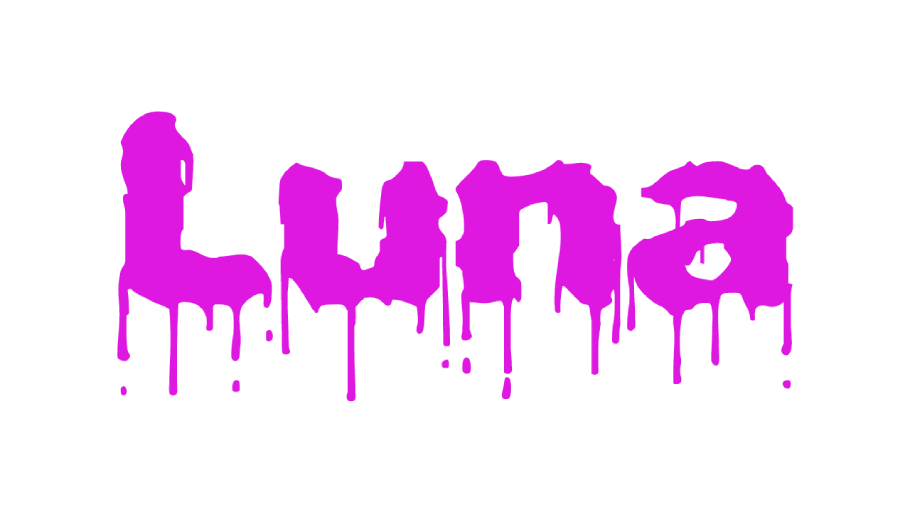

<div align="center">
	
</div>

<hr />

### About
**Luna** creates a module containing all your modules, and keeps it updated as you edit your project. I will call the module 'Library' in this tutorial but you can configure it to whatever you like. The extension works as a module loader, but with intellisense.

You have to use [Rojo](https://rojo.space/) in your project for this to work.\
For intellisene you have to use something like [Roblox LSP](https://github.com/NightrainsRbx/RobloxLsp).

&nbsp;

### Getting Started

1. Install the extension [here](https://marketplace.visualstudio.com/items?itemName=Ezzenix.luna-roblox).
2. Run the '**Luna: Open Menu**' command.
3. Select '**Start Luna**' and a configuration file will be generated for you to edit. See below for information about the config.
4. After customizing the configuration select '**Start Luna**' again to start it.
5. You can now start using it!

\
**Example:**

```lua
-- Require the Library created by the extension, the path depends
-- on your "modulePath" property and your Rojo project configuratin.
local Library = require(game:GetService("ReplicatedStorage").Library)

Library.MyModule.Say("Hello") -- This will now have intellisense unlike normal module loaders.
```

&nbsp;

### Config
|Option|Description|Default Value|
|-|-|-|
|modulePath|Path of the module to generate|"ReplicatedStorage/Library"|
|rojoProject|Name of your rojo project|"default.project"|
|variableName|Variable name of the Library in your own scripts, used for dependency checking|["StarterPlayerScripts"]|
|directories|The directories you want to use, a global one is added by default but here you can customize your own. *path* is the folder path in your project. *restricted* can be either false, "CLIENT" or "SERVER". *makeCategory* will put the modules in their own directory in the Library, for example: *Library.Utils.Add()* instead of *Library.Add()*. *loadOrder* is in which order it should be loaded.|*See example below*|

**Example:**
```json
{
	"modulePath": "ReplicatedStorage/Library",
	"rojoProject": "default.project",
	"variableName": "Library",

	"directories": [
		{
			"path": "ReplicatedStorage/Utils",
			"restricted": false,
			"makeCategory": true,
			"loadOrder": 1
		},
		{
			"path": "ServerScriptService",
			"restricted": "SERVER",
			"makeCategory": false,
			"loadOrder": 2
		}
	]
}
```

<font size=2>Paths in the config are file paths in your project, not game paths.\
After configuring your project the extension will automatically start when you open it the next time.</font>

&nbsp;

### Contact
If you need help you can add me on discord **Ezzenix#5500**.