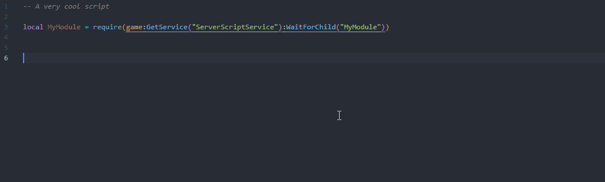
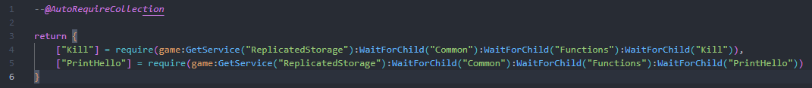

## Features

Creates autocompletions for your modules and automatically requires them if necessary.

Automatically requires all child modules of a module. Just put `--@AutoRequireCollection` in the `init.lua` file, it will overwrite the rest of the file so be careful.

## Install
* Setup [Rojo](https://rojo.space/) in your project if you haven't already.
* Download the extension [here](https://marketplace.visualstudio.com/items?itemName=Ezzenix.auto-require-roblox) or from the extensions tab directly.

## Config
You can create a config file `.autorequire.json` by running the `AutoRequire: Create configuration file` command in the command palette.
|Option|Description|Default|
|-|-|-|
|rojoProject|Path to the Rojo project you are using|"default.project.json"|
|enableModuleCollection|Should module collections be enabled|true|