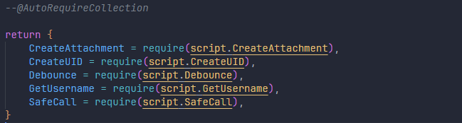

## Features

#### Autocompletion
Creates autocompletions for your modules and automatically requires them if necessary.

#### Collections
Automatically requires all child modules of a module. To create one you put `--@AutoRequireCollection` at the top of your `init.lua` file, **it will overwrite the rest of the file so please be careful**.

Collections are updated automatically when new files are created or deleted. But they can also be updated manually with the `AutoRequire: Update all collections` command in the command palette.

## Install
* Setup [Rojo](https://rojo.space/) in your project if you haven't already, it is required.
* Download the extension [here](https://marketplace.visualstudio.com/items?itemName=Ezzenix.auto-require-roblox) or from the extensions tab directly.

## Config
You can create a config file `.autorequire.json` by running the `AutoRequire: Create configuration file` command in the command palette.
|Option|Description|Default|
|-|-|-|
|enableModuleCollection|Should module collections be enabled|true|
|alwaysShowSubModules|Should sub modules always be shown in autocomplete|false|
|ignoreEnvironment|Disable environment detection and allow any module|false|
|clientDirectories|Array of directories to always detect as client||
|serverDirectories|Array of directories to always detect as server||
